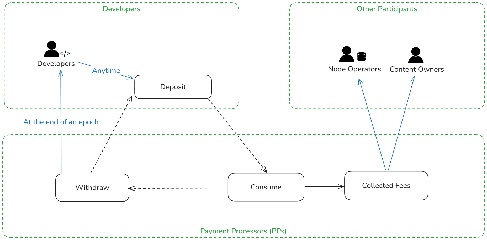

```
REP: REP-43
Title: Introducing Payment Processor for Request Fees
Status: Draft
Type: Core
Created: 26 Jul 2024
Author(s): Nya Candy <dev@candinya.com>
Description: This REP description a request billing and reward distributing cycle of Ownership Economy.
Discussions: https://forum.rss3.io/t/rep-draft-on-request-fees/176
```

# REP-43: Introducing Payment Processor for Request Fees

## Table of Contents

- [Abstract](#abstract)
- [Motivation](#motivation)
- [Specification](#specification)
  - [Request billing: the cycle](#request-billing-the-cycle)
- [Rationale](#rationale)

## Abstract

This proposal introduces a request billing and reward distribution mechanism for the RSS3 Network. Payment Processors (PPs) follow the mechanism to bill developers based on their usage and distribute the collected fees to Node Operators and content owners based on their contributions. The primary goal is to foster a healthy and sustainable Ownership Economy by assigning value to data production and consumption.

## Motivation

Currently, developers make requests at no cost, while Node Operators are covering a substantial infrastructure cost. Under the current setting where rewards are distributed to Node Operators by the network, there is no new inflow of funds, resulting in an economy that is not expanding and not sustainable. A solution to is to introduce reasonable request fees, which promotes an economic cycle. At the same time, free requests will remain available with a reasonable rate limit.

## Specification

This proposal introduces the Payment Processsor, which acts as load balancer for GIs to assist request distribution, request billing, and fee distribution.

Detailed technical implementations are outside the scope of this proposal, please refer to the relevant source code repositories and documentation, the focus here is on describing the mechanism.



### Request billing: the cycle

The economic cycle consists of three stages: Deposit, Consumption and Withdraw.

1. Deposit is a way for developers to fund their requests, using a pre-paid mechanism. The developer can invoke the contract's deposit function at any time the Network is running, and PP will then update the usage limit after the corresponding deposit transaction is finalized on VSL. The deposit is temporarily stored in a pool controlled by PP.
2. Consumption refers to when the developer make requests with the assigned credentials, PP records total consumption. If a developer’s usage exceeds the deposit coverage, the requests will be rate limited.
3. Settlement refers to when PP deducts corresponding tokens from the deposit pool based on usage, which takes place at the end of each epoch. The collected fees are then sent to Node Operators and content owners based on their contributions.
4. Withdrawal refers to the process of refunding the remaining deposit to the developer after deducting their usage cost. Since it requires the deduction of actual spending, withdrawals are only settled at the end of each epoch when settlement is complete, and the refund is sent to the original depositor only.

## Rationale

The core of this proposal is the introduction of Payment Processor to foster a sustainable economic cycle on RSS3 Network. The mechanism will ensure Node Operators and content owners are rewarded for their contributions to RSS Network.
